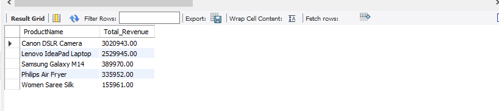
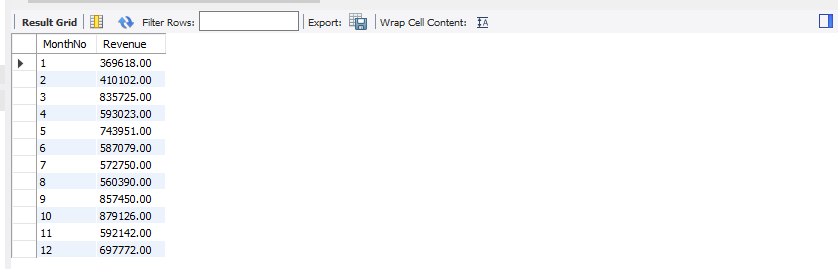
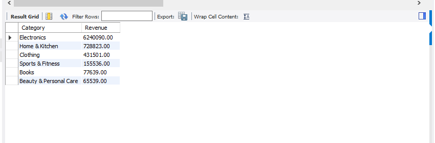

#  E-Commerce Sales Analysis using SQL

##  Project Overview
This project demonstrates SQL-based analysis of an E-Commerce sales dataset. The database contains order information including customers, products, categories, prices, quantities, order dates, and countries.

The goal of this project is to perform business analysis using SQL queries and extract meaningful insights from sales data.

---

##  Database Structure

### Table: Orders

| Column Name | Data Type | Description |
|------------|-----------|-------------|
| OrderID | INT | Unique Order ID |
| CustomerID | INT | Customer Identifier |
| ProductName | VARCHAR(100) | Product Name |
| Category | VARCHAR(50) | Product Category |
| Quantity | INT | Quantity Purchased |
| Price | DECIMAL(10,2) | Product Price |
| OrderDate | DATE | Date of Order |
| Country | VARCHAR(50) | Customer Country |

---

##  Technologies Used
- MySQL Workbench
- SQL
- Relational Database Concepts
- GitHub

---

##  Business Questions Solved

###  Product Analysis
- Top 5 best-selling products by quantity sold
- Top 5 revenue-generating products

**Result:**


###  Customer Analysis
- Customer with the highest number of orders
- Top 5 most active customers
- Customer who spent the most money overall
- Customers who ordered more than 3 times

###  Revenue Analysis
- Total revenue generated
- Monthly revenue trend for 2023

**Result:**


- Country generating the highest revenue
- Category generating the highest revenue

**Result:**


###  Category Analysis
- Number of orders in each category
- Average order value per category

---

##  Key Insights
- **Electronics** is the highest revenue-generating category with ₹62,40,090.
- **Canon DSLR Camera** is the top revenue-generating product.
- **October** had the highest monthly revenue in 2023.
- **India** is the primary market across all orders.

---

##  Sample Queries

### Total Revenue
```sql
SELECT SUM(Quantity * Price) AS Total_Revenue
FROM Orders;
```

### Top 5 Revenue Generating Products
```sql
SELECT ProductName,
       SUM(Quantity * Price) AS Total_Revenue
FROM Orders
GROUP BY ProductName
ORDER BY Total_Revenue DESC
LIMIT 5;
```

### Monthly Revenue Trend
```sql
SELECT MONTH(OrderDate) AS MonthNo,
       SUM(Quantity * Price) AS Revenue
FROM Orders
WHERE YEAR(OrderDate) = 2023
GROUP BY MONTH(OrderDate)
ORDER BY MonthNo;
```

---

##  Key SQL Concepts Used
- SELECT, WHERE, GROUP BY, ORDER BY
- HAVING
- Aggregate Functions — SUM(), COUNT(), AVG(), MAX()
- LIMIT
- Date Functions — MONTH(), YEAR()

---

##  Learning Outcomes
By completing this project, I practiced:
- Data aggregation and reporting
- Revenue and sales trend analysis
- Customer behavior analysis
- Product performance analysis
- Business intelligence using SQL
- Writing optimized SQL queries

---

##  Project Author
**Ishika Sharma**
BCA Student | Data Analytics & SQL Enthusiast
